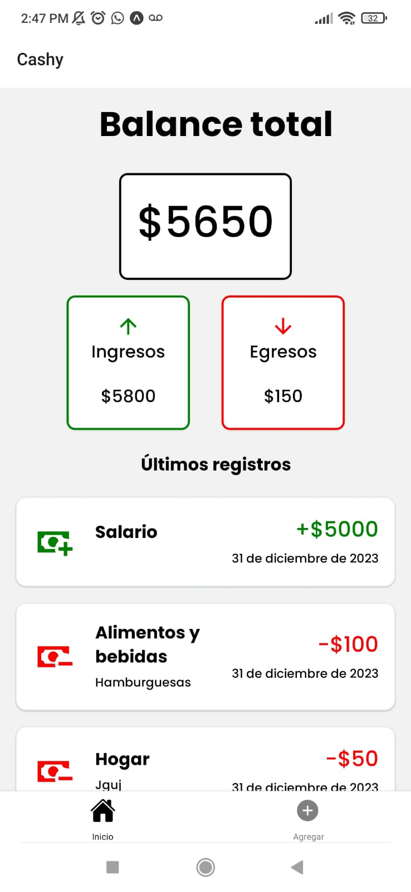
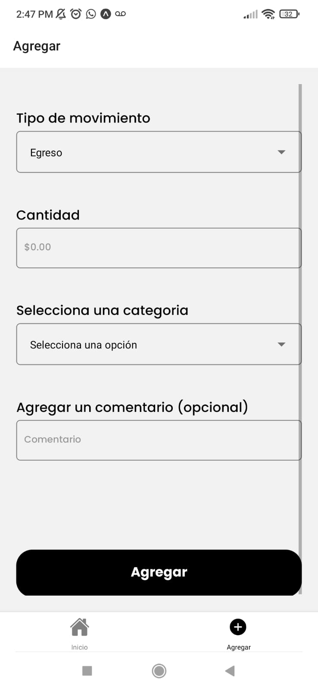

# Aplicación de Finanzas(Cashy)

## Descripción

Esta es una aplicación desarrollada en React Native para llevar un control de tus finanzas personales. La aplicación utiliza AsyncStorage para almacenar los datos localmente en tu dispositivo.

## Características

- **Balance Total**: Puedes ver el balance total de tus finanzas en la pantalla principal de la aplicación.
- **Ingresos y Egresos**: La aplicación muestra el total de tus ingresos y egresos.
- **Lista de Registros**: Puedes ver una lista de todos tus registros financieros, que incluye la categoría, el comentario, el monto y la fecha de cada registro.
- **Formulario de Registro**: La aplicación incluye un formulario de registro donde puedes introducir nuevos movimientos financieros. Existen dos tipos de movimientos: ingresos y egresos. En el formulario, puedes introducir la cantidad, seleccionar la categoría y agregar comentarios a tu registro.

## Capturas de Pantalla

A continuación, se muestran dos capturas de pantalla de la aplicación:

1. **Pantalla de Inicio**:

   

2. **Pantalla del Formulario de Registro**:

   
## Conclusión

Esta aplicación es una herramienta útil para llevar un control de tus finanzas personales. Te permite tener una visión clara de tus ingresos y egresos, y mantener un registro de todos tus movimientos financieros.

## Descarga la aplicación

🤖 Aplicación Android: [Descargar APK](https://expo.dev/artifacts/eas/f8JKrhvHLLtvw9wpwNoqGn.apk)

